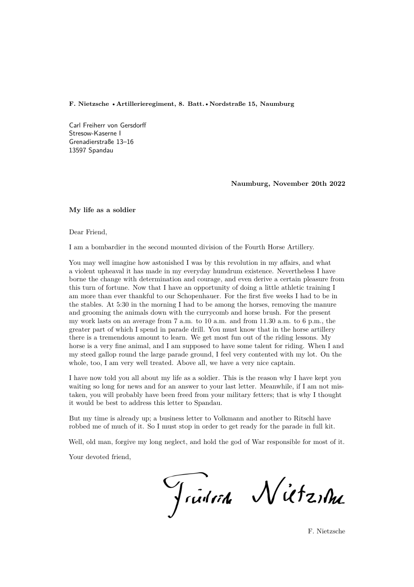

# Simple Letter

A [Craftadoc](https://craftadoc.com) template. (Using LaTeX.)

Easily create a beautiful letter by using the Simple Letter template. It starts with the return address shown in bold at the top, split using bullet points. The address of the receiver comes below it.
Then come the city, date, and subject, which are all optional.
After the letter body you have the possibility of adding a signature image, followed by your name.

### How do I use this?

#### Option 1:

Directly use the template in your browser using Craftadoc [here!](https://app.craftadoc.com/template/overview/637cd3b3e354f40a11cd752c) And fill in the template using the automatically generated UI. This is the easiest option.

#### Option 2:

Open the source code in Overleaf: visit [the template page](https://app.craftadoc.com/template/overview/637cd3b3e354f40a11cd752c), select the gear icon in the top right and select `Open in Overleaf`.

#### Option 3:

Clone this repository and use your favorite latex compiler locally. (This template uses XeLatex.)

## Example:

## Source:
https://github.com/mrzool/letter-boilerplate
